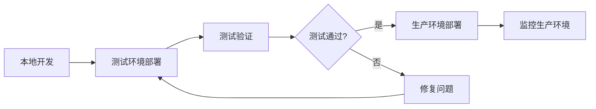

# 🚀 现在可以开始部署了！

## ✅ 问题已修复

部署脚本的所有问题已经解决：
- ✅ PowerShell 语法错误已修复
- ✅ 路径配置错误已修复
- ✅ 所有路径验证通过

---

## 📋 部署步骤

### 1️⃣ 测试环境部署（推荐先部署测试）

```powershell
# 在项目根目录运行
cd C:\universe\GitHub_try\IEclub_dev

# 部署全部（前端 + 后端）
.\scripts\deployment\Deploy-Staging.ps1 -Target all -Message "测试新功能"

# 或仅部署前端
.\scripts\deployment\Deploy-Staging.ps1 -Target web -Message "更新前端"

# 或仅部署后端
.\scripts\deployment\Deploy-Staging.ps1 -Target backend -Message "更新后端"
```

**测试环境地址**: https://test.ieclub.online

---

### 2️⃣ 生产环境部署（测试通过后）

```powershell
# 在项目根目录运行
cd C:\universe\GitHub_try\IEclub_dev

# 部署全部（需要输入 YES 确认）
.\scripts\deployment\Deploy-Production.ps1 -Target all -Message "正式发布 v1.x"

# 或仅部署前端
.\scripts\deployment\Deploy-Production.ps1 -Target web -Message "更新前端"

# 或仅部署后端
.\scripts\deployment\Deploy-Production.ps1 -Target backend -Message "更新后端"
```

**生产环境地址**: https://ieclub.online

---

## ⚠️ 注意事项

### 部署前检查

1. **SSH 连接**
   ```bash
   # 确保能连接到服务器
   ssh root@ieclub.online
   ```

2. **服务器状态**
   - 确保服务器有足够的磁盘空间
   - 确保数据库服务正常运行
   - 确保 Redis 服务正常运行

3. **环境配置文件**
   - 测试环境: 服务器上需要有 `/root/IEclub_dev_staging/ieclub-backend/.env.staging`
   - 生产环境: 服务器上需要有 `/root/IEclub_dev/ieclub-backend/.env.production`

### 部署流程

脚本会自动执行以下步骤：

1. ✅ 提交代码到 Git
2. ✅ 推送到 GitHub
3. ✅ 构建前端（如果选择了 web）
4. ✅ 打包代码
5. ✅ 上传到服务器
6. ✅ 备份当前部署
7. ✅ 部署新版本
8. ✅ 重启服务
9. ✅ 健康检查
10. ✅ 如果失败，可以回滚

### 健康检查

部署完成后，脚本会自动检查：

- **前端**: https://test.ieclub.online (测试) 或 https://ieclub.online (生产)
- **后端API**: https://test.ieclub.online/api/health (测试) 或 https://ieclub.online/api/health (生产)

如果健康检查失败，脚本会提供详细的诊断信息，并询问是否回滚。

---

## 🆘 遇到问题？

### 常见问题

1. **SSH 连接失败**
   ```
   解决: 检查网络连接，确认服务器 IP 和端口正确
   ```

2. **健康检查失败**
   ```
   解决: 查看脚本输出的诊断信息
   - 检查 PM2 进程状态
   - 查看应用日志
   - 检查端口占用
   - 验证数据库连接
   ```

3. **权限问题**
   ```
   解决: 确保有 SSH 权限和服务器文件写入权限
   ```

### 查看日志

```bash
# SSH 连接到服务器
ssh root@ieclub.online

# 查看测试环境日志
pm2 logs staging-backend

# 查看生产环境日志
pm2 logs ieclub-backend

# 查看 PM2 进程状态
pm2 status
```

---

## 📚 相关文档

- 📖 [完整部署指南](docs/deployment/Deployment_guide.md)
- 🔧 [脚本修复记录](docs/DEPLOYMENT_FIX_2025_11_05.md)
- 📝 [项目文档索引](docs/INDEX.md)
- 🚀 [快速参考](REMIND.md)

---

## 🎯 推荐部署流程



1. 在本地开发环境完成功能开发
2. 部署到**测试环境**进行验证
3. 测试通过后，再部署到**生产环境**
4. 持续监控生产环境运行状态

---

**准备好了吗？让我们开始部署吧！** 🚀

